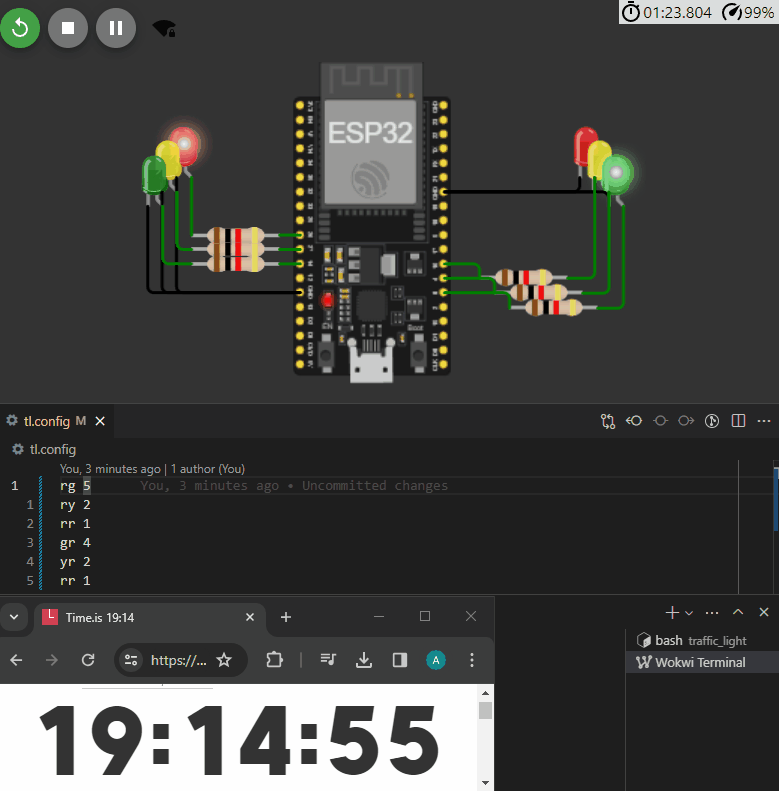

# Introduction

This is a simulation of a traffic controller implementation with ESP32.

It is intended to coordinate multiple traffic lights with a specification of their
states and also synchronize the internal clock via SNTP so that the controller
could theoretically be coordinated with others.

A `README.md` file more directly related to the whole setup can be seen in
`docs/README.md`,

## How to run

The best way to run this out of the box is using a dev container in VSCode.
For that, make sure you have Docker installed and know the basics of how to work
with it.

The repo is set up in a way that, once you open VSCode, it will prompt you into
entering the dev container directly. Upon accepting it, you can run the simulation
by clicking the `diagram.json` file. Read about the [Wokwi extension](https://docs.wokwi.com/vscode/getting-started)
for more details.

The simulation runs based on the built binary. So, if you want to make changes to the
code, recompile it with `cargo build` and reopen `diagram.json`.

The animation below represents a full cycle of 15 seconds with 0 offset. Since 60
divides 15 and the offset is based on the unix epoch, we should expect a cycle
to start at the beginning of a minute precisely.



## Configuration

### States

By tweaking `tl.config`, you can choose different durations and states for the controller.

The syntax for `tl.config` is inspired by [SUMO](https://sumo.dlr.de/docs/Simulation/Traffic_Lights.html)
and consists of a specification, in each line, of a sequence of 'r', 'g' or 'y'
characters, and then a duration in seconds separated by a space from the sequence of
characters.

An example follows below:

```text
rg 20
ry 3
rr 2
gr 30
yr 3
rr 2
```

This would represent two traffic lights, where the first starts as red and the second
as green for 20 seconds, then there is a 5-second transition (split as 3 seconds
in yellow and 2 seconds of all-reds) into 30 seconds of the first being green and
the second being red.

### Offset

You can select an *offset* for the traffic plan by putting a number on top of the
states selections, like so:

```text
10

rg 20
ry 3
rr 2
gr 30
yr 3
rr 2
```

This establishes the point of reference to be the Unix epoch + 10 seconds.